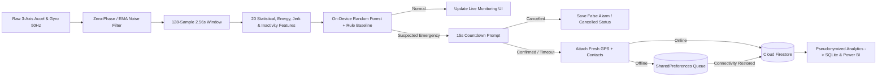
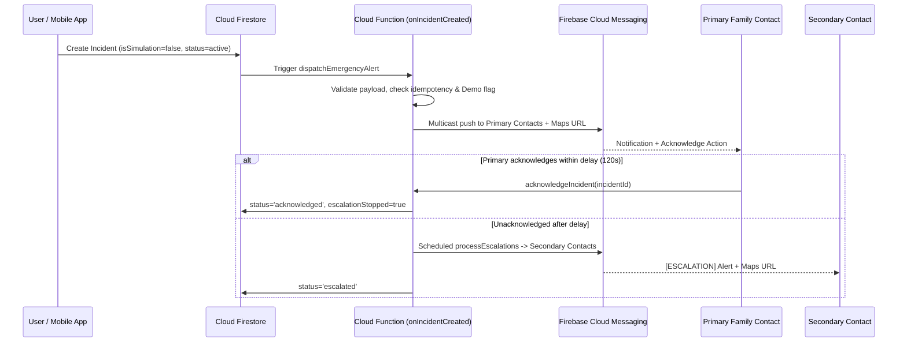

# Data Flow & Emergency Notification Workflows

## 1. End-to-End Data Flow Diagram

```mermaid
flowchart LR
    Raw[Raw 3-Axis Accel & Gyro 50Hz] --> Filter[Zero-Phase / EMA Noise Filter]
    Filter --> Window[128-Sample 2.56s Window]
    Window --> Features[20 Statistical, Energy, Jerk & Inactivity Features]
    Features --> Infer[On-Device Random Forest + Rule Baseline]
    Infer -->|Normal| LogTelemetry[Update Live Monitoring UI]
    Infer -->|Suspected Emergency| Verify[15s Countdown Prompt]
    Verify -->|Cancelled| CancelRec[Save False Alarm / Cancelled Status]
    Verify -->|Confirmed / Timeout| Enrich[Attach Fresh GPS + Contacts]
    Enrich -->|Online| Firestore[(Cloud Firestore)]
    Enrich -->|Offline| LocalQ[(SharedPreferences Queue)]
    LocalQ -->|Connectivity Restored| Firestore
    Firestore --> Analytics[Pseudonymized Analytics -> SQLite & Power BI]
```

## 2. Emergency Notification & Escalation Workflow

```mermaid
sequenceDiagram
    participant U as User / Mobile App
    participant FS as Cloud Firestore
    participant CF as Cloud Function (onIncidentCreated)
    participant FCM as Firebase Cloud Messaging
    participant P as Primary Family Contact
    participant S as Secondary Contact

    U->>FS: Create Incident (isSimulation=false, status=active)
    FS->>CF: Trigger dispatchEmergencyAlert
    CF->>CF: Validate payload, check idempotency & Demo flag
    CF->>FCM: Multicast push to Primary Contacts + Maps URL
    FCM-->>P: Notification + Acknowledge Action
    alt Primary acknowledges within delay (120s)
        P->>CF: acknowledgeIncident(incidentId)
        CF->>FS: status='acknowledged', escalationStopped=true
    else Unacknowledged after delay
        CF->>FCM: Scheduled processEscalations -> Secondary Contacts
        FCM-->>S: [ESCALATION] Alert + Maps URL
        CF->>FS: status='escalated'
    end
```
